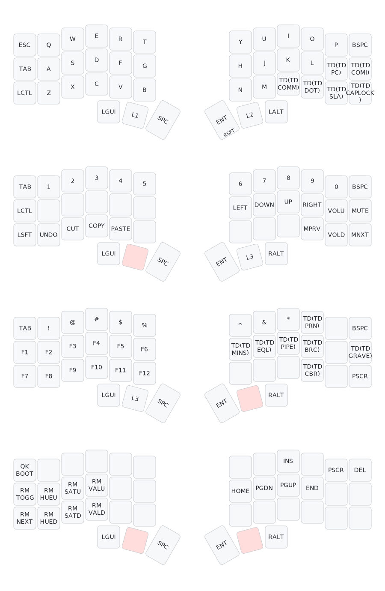

# Corne (crkbd) — Keymap de Guevados

Layout personalizado para el Corne (crkbd/rev1) con 4 capas y tap dance.

## Diagrama del keymap

Generado automáticamente con [keymap-drawer](https://github.com/caksoylar/keymap-drawer) vía GitHub Actions.



> Si no se ve la imagen arriba, es porque el workflow aún no se ha ejecutado.
> Ve a la pestaña **Actions** en GitHub → **Draw keymap** → **Run workflow**.

## Características

* 4 capas: Base, Navegación/Números, Símbolos/Funciones, Sistema/RGB
* Tap dance para caracteres con doble función (ej: `;` / `:`, `,` / `<`, `(` / `)`)
* Compatible con VIA
* Thumb cluster con mod-tap (Shift/Enter, layer-tap)
* Friendly para Mac (GUI/Command y Alt/Option en los thumbs)
* Friendly para Vim (Esc, Tab y Ctrl accesibles)

## Estructura del repo

```
keymap.c                      # Keymap en C para QMK
config.h                      # Configuración (tapping term, RGB, etc.)
rules.mk                      # Reglas de compilación (VIA, tap dance)
keymap-drawer/                # Output automático del workflow
  crkbd-guevados.svg          # Diagrama visual del keymap
  crkbd-guevados.yaml         # Representación YAML editable
.github/workflows/
  draw-keymap.yml             # Workflow que genera el SVG automáticamente
```

## Automatización

El workflow [draw-keymap.yml](.github/workflows/draw-keymap.yml) se ejecuta automáticamente al modificar `keymap.c`, `config.h` o `rules.mk`, y genera el diagrama SVG del keymap.
